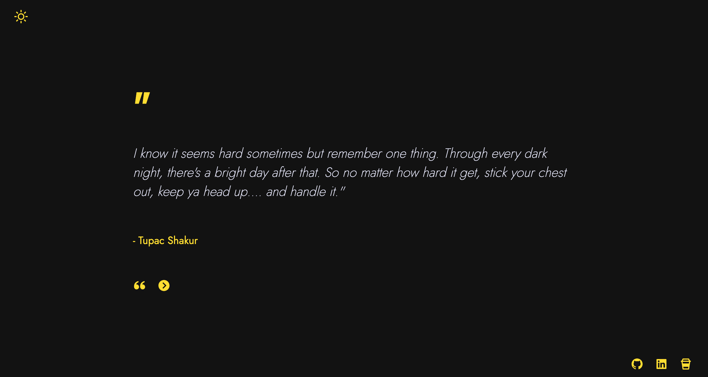
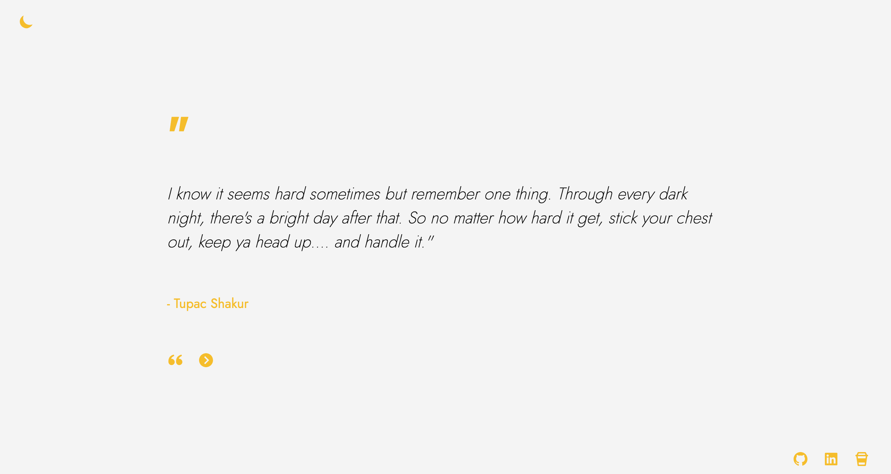

# Quote of the Day
Your daily dose of inspiration. This is a random quote generator built with ReactJs and ChatGPT4 that can be used as a background. 

### [Live Website](https://sabrinabertol.github.io/ai-random-quote-generator/)
## Some Images:

## Table of Contents
- [Introduction](#introduction)
- [Features](#features)
- [Technologies Used](#technologies-used)
- [Installation](#installation)
- [Usage](#usage)
- [Contributing](#contributing)
- [License](#license)

## Introduction
*Quote of the Day* is a random quote generator that can be used as a background, giving you little doses of daily inspiration. 

## Features
- Light / Dark mode (change the appearence of the website, depending on your mood).
- Auto Quotes (automatically fetch a new quote every 30 seconds).

## Technologies Used
- React.js: A JavaScript library for building user interfaces.
- HTML5 & CSS3: Markup and styling languages for building web pages.
- JavaScript: A programming language for adding interactivity to web applications.
- Style-Components: A CSS framework for creating responsive and mobile-first designs.
- Git: A version control system for tracking changes and collaborating on projects.
- GitHub Pages: A platform for hosting and deploying web applications.

## Installation
To run this project locally, follow these steps:

1. Get a free API Key at [RapidAPI](https://rapidapi.com/)
2. Clone the repository: `git clone https://sabrinabertol.github.io/ai-random-quote-generator.git`
3. Navigate to the project directory: `cd ai-random-quote-generator`
4. Enter your RapidAPI key in the created .env file: `REACT_APP_API_KEY=YOUR RAPID API KEY`
5. Install the dependencies: `npm install`
6. Start the development server: `npm start`
7. Open your browser and visit: `http://localhost:3000`

## Usage
After installing and running the project locally, you can change from light to dark mode in the navbar, fetch a new quote or start the auto quote function, that will fetch a new quote for you every 30 seconds. You can also reach me by the contact links in the footer!

## Contributing
Contributions are welcome! If you'd like to contribute to this project, please follow these steps:

1. Fork the repository.
2. Create a new branch for your feature or bug fix: `git checkout -b my-feature`
3. Commit your changes: `git commit -m 'Add some feature'`
4. Push to the branch: `git push origin my-feature`
5. Open a pull request.

## Acknowledgments

- [React Tooltip](https://react-tooltip.com/)
- [React Icons](https://react-icons.github.io/react-icons/)

<a href="#readme-top">back to top</a>
